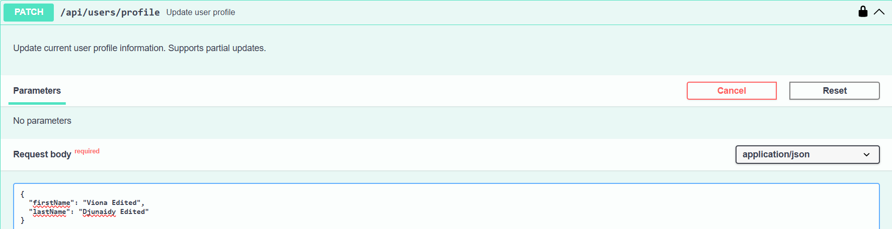
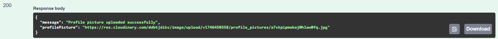

# Todo App API Testing Documentation

This document provides detailed information about the testing of each API endpoint using Swagger UI. Each test includes the request, response, and authorization aspects of the API endpoints.

## Authentication Endpoints

### 1. User Signup
- **Endpoint**: `POST /api/users/signup`
- **Test Description**: Testing user registration with email, password, first name, and last name
- **Request Example**:

- **Response Example**:

### 2. User Login
- **Endpoint**: `POST /api/users/login`
- **Test Description**: Testing user authentication with email and password
- **Request Example**:

- **Response Example**:

### 3. Authorization Test
- **Test Description**: Demonstrating the Bearer token authentication requirement
- **Examples**:

## User Profile Management

### 1. Get User Profile
- **Endpoint**: `GET /api/users/profile`
- **Test Description**: Retrieving authenticated user's profile information
- **Request Example**:

- **Response Example**:

### 2. Update User Profile
- **Endpoint**: `PATCH /api/users/profile`
- **Test Description**: Updating user profile information (first name and last name)
- **Request Example**:

- **Response Example**:

### 3. Upload Profile Picture
- **Endpoint**: `POST /api/users/profile/upload`
- **Test Description**: Uploading user profile picture using multipart/form-data
- **Request Example**:

- **Response Example**:

## Todo Management

### 1. Create Todo
- **Endpoint**: `POST /api/todos`
- **Test Description**: Creating a new todo item with title and description
- **Request Example**:

- **Response Example**:

### 2. Update Todo
- **Endpoint**: `PATCH /api/todos/{id}`
- **Test Description**: Updating a todo's title, description, completion status, or editing status
- **Request Example**:

- **Response Example**:

### 3. Get Todo by ID
- **Endpoint**: `GET /api/todos/{id}`
- **Test Description**: Retrieving a specific todo by its ID
- **Request Example**:

- **Response Example**:

### 4. Get All Todos
- **Endpoint**: `GET /api/todos`
- **Test Description**: Retrieving all todos for the authenticated user
- **Request Example**:

- **Response Example**:

## Security Features

1. **JWT Authentication**: All protected endpoints require a valid JWT token
2. **Password Hashing**: User passwords are hashed using bcrypt before storage
3. **Token-based Authorization**: Each request is validated using Bearer token authentication
4. **User-Specific Data Access**: Users can only access and modify their own todos and profile
